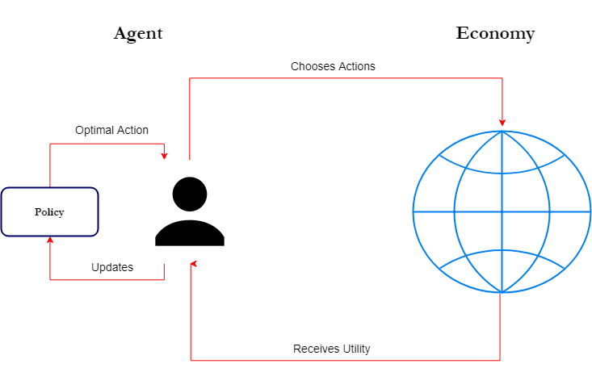

# The Economy

## Overview

In this model, the economy consists of three types of agents (the set of agents is denoted by $\mathcal{A}$), each of discrete measure:

\[
\mathcal{A} = <\{\mathcal{H}_h\}_{h \in H},\{\mathcal{B}_b\}_{b \in B},\{\mathcal{E}\}_{e\in E}>
\]

Where the three types are:

* households ($\mathcal{H}$), numbering $H$, with a typical member $h$; 
* banks ($\mathcal{B}$), numbering $B$ with a typical member $b$; 
* and firms (or entrepreneurs - $\mathcal{E}$), numbering $E$, with a typical member $e$.  

There are also two goods - a consumption good $c$ (which also serves also as a store of value and a numeraire), and a production good (capital - $k$). Households are endowed with labor units $l$, while firms have access to a production technology ("projects" - described below), that allows them to convert units of the consumption good into units of the production good. The total amount of labor $L$, and the total amount of capital $K$, can be combined to produce units of the consumption good, by the production function $AF(K,L)$. After production owners of capital and labor receive the respective rental rate ($r$) and wage rate ($w$) in terms of units of $c$.

Households choose how much to consume each period, for which they receive utility $u(c)$, and how much to save. It is assumed that households and firms cannot interact directly. Instead savers can choose to deposit savings in a intermediary (bank). In return the bank pays a per-period interest on savings. Firms interact with banks by taking out loan contracts (in terms of $c$) and repaying interest. It is assumed that banks are free to engage into loan contracts among each other, while other agents can only engage with banks (the implementation mechanism is explained into detail below).

Firms can use their funds (either earned through return to capital or loaned from banks) to invest into projects. A project is a technology that requires a fixed up-front investment of consumption good and which returns a stochastic flow of units of the investment good. It is assumed that each unit of the investment good produced is immediately devoted to production of the final good.

The following diagram summarizes the process:


## Interactions

Each period of the economy consists of a series of interactions between agents (or between agents and environment). The turn in which this interactions happen is as follows:

> 0. Interest payments on outstanding loans from firms to banks, from banks to banks, and from banks to households (in that order) are repaid. Any new overnight loans (if needed and if available) are taken out. Any potential insolvencies are resolved. Banks with reserves exceeding their own 'reserve target' pay out dividends equal to the excess reserves over the target.
1. Each bank decides
  + Whether and by how much to change the interest rate offered on deposits
  + Whether and by how much to change the interest rate offered on loans
  + Whether and by how much to change the target (or desired) reserve rate
2. Banks decide whether to open overnigh-credit lines among each other. 
3. Each household examines all of its outstanding deposits and decides whether to wtihdraw it or not.
4. Each household gets matched with three random banks and decides whether to invest its available funds in any of it at the current deposit rate. Everything not invested is consumed.
5. Each firm is randomly matched with a project. The firm then decides whether to keep the project or discard it. Each firm that decides to keep the project and has enough funds to invest in it does so.
6. Firms that decide to keep the project but don't have enough funds to invest are randomly matched with three banks. They then chose to which of the three to apply for a loan (at the current loan interest rate).
7. Banks that have received a loan application make a yes/no decision on each application. If approved the firm receives a fixed-payment loan on the current loan interest rate, with a maturity defined by the project duration.
8. Banks with excess reserves decide whether and how much divident to distribute (in discrete porportion of the total amount of excess reserves)
9. Each project yields units of the production good for the firm that owns it
10. All units of labor and of te production good are invested in final good production. Firms and households receive factor income.

The following gives out more details about each step of the period:

### Step 0
At the very beginning of the period all interest payments from firm to banks and from banks to households are made. This step is automatic and does not require active decision making. On the firms side, since every project undertaken from the firm is financed by at most one bank, the repayment procedure can be expressed in pseudo-code as:

```
for (firm in Firms):
  for (project in firm.projects):
    bank = project.bank
    payment = project.interest
    if (firm.assets > payment):
      firm.assets.decrease(payment)
      bank.assets.increase(payment)
    else:
      bank.assets.increase(firm.assets)
      firm.default()
    end if
  end for
end for
```
Older loans are repaid first. If the firm cannot repay a loan a default procedure ensues. When a firm defaults, all its projects are liquidated (each project has a liquidation value). Banks that have given out loans for each project then receive the liquidation amount (which could also be $0$). A defaulted stays inactive for four periods, after which it is recapitalized (by the households) and resumes normal activity.

The process for payments from banks to depositors is similar. In the case of a bank default, depositors get paid on a first come - first serve basis. If a bank defaults it stays inactive indefinitely.

### Step 1
In the next step banks get to adjust the prices of their products. Each bank has two products - a deposit offering, and a loan offering. It is assumed that banks are restricted in their price adjustments, and can only change the price incrementally in one period. More specifically, each bank can either increase or decrease the offered interest rate for a product by $0.1$ or $0.05$ percentage points in one period. The bank also has the option to leave the price of a loan/deposit unchanged.

Banks also get to choose their 'desired' reserve ratio (expressed in % of total liabilities). This is essentially capturing the banks' dividend policy. If at the end of phase $0$ of the next turn the bank has more than this amount of reserves, it will pay out the excess as dividend. Similar to interest rates, the target reserve percentage can only be changed in increments. 

We can express the options as follows:
```
for (bank in Banks):
  bank sets deposit interest rate at one of:
    current rate - 0.05%
    current rate - 0.10%
    current rate
    current rate + 0.05%
    current rate + 0.10%
  bank sets loan rate at one of:
    current rate - 0.05%
    current rate - 0.10%
    current rate
    current rate + 0.05%
    current rate + 0.10%
  bank sets target reserve ratio as
    current ratio - 0.10%
    current ratio - 0.05%
    current rato
    current ratio + 0.05%
    current ratio + 0.10%
end for
```

There are two reasons for choosing this price modification scheme. First it ties into the framework of sticky prices that is often present in New Keynesian models. Second, at more importantly perhaps, it allows for an easier implementation of the agent's decision process described below. Some may argue that this mode of price adjustment can be considered unrealistic, but it is a limitation of the current modeling framework.

### Step 2
In this step each bank decides whether or not to extend an overnight credit line to any other bank. The decision process goes as follows:
```
for (loaner_bank in Banks):
  loaner_bank.close_all_credit_lines()
  for (borrower_bank in Banks):
    decision = loaner_bank.creditLineDecision(borrower_bank)
    if (decision == 1):
      loaner_bank.open_credit_line(borrower_bank)
    else:
      pass
    end if
  end for
end for
```

Overnight credit lines play a role in step 3 of this turn, and step 0 of the next turn. If after a bank has paid interest rate to depositors (step 0), or after it has paid the principal on closed accounts (step 3), three things can happen:

* The bank had enough reserves to carry out all payments and still be above the regulatory minimum reserve requirement
* The bank had enough reserves to carry out all payments, but its reserves have dwindled below the minimum
* The bank didn't have enough reserves to carry out all payments.

In the first case nothing happens, and in the third the bank goes into insolvency (described below). In the second case the bank automatically (no decision required) applies for an overnight loan. In this case if any other bank has an open credit line to this distressed bank, it automatically (again no decision) lends out the required difference in order for the distressed bank to meet the reserve minimums (if more than one bank has opened a credit line to the distressed bank, they share the loan equally).

The terms of inter bank loans are exogenous to the model. The inter-bank interest rate and the loan period (set to 1 or 2 periods) are decided on by the analyst. This is at first glance a deficiency in the model, and it is true that this approach was taken mainly to keep the model more streamlined and tractable. However even this setup captures some important aspects of real-life overnight loans, as the interest on this loans is usually controlled by the monetary authority. Even though the current version of the model does not have a monetary-authority-agent that does open market operations, we will still adhere to the banks taking the inter-bank rate as given. Furthermore, as some have pointed out (citation needed), in the build up to the 2008 financial crisis many banks chose not to lend in the inter bank market, even though rates were high - showing that the choice to model the participation decision may be appropriate.

### Step 3
The next step is straightforward - each households makes a series of consecutive decisions (as many as the number of banks it has deposited funds into) whether to withdraw a deposit or not. Funds from withdrawn deposits are added to the households cash on hand.

```
for (household in Households):
  for (bank in household.depositBanks):
    decision = household.withdrawDecision(bank)
    if (decision == True):
      amount = household.depositBanks.amount
      bank.deposits.decrease(amount)
      household.cash.increase(amount)
    end if
  end for
end for
```

### Step 4
In the next step household decide where to deposit their cash on hand (or whether to consume it). The process goes as follows:

```
for (household in Households):
  matchedBanks = selectRandom(Banks, 3) # 3 random banks
  decision = household.DepositDecision(matchedBanks)
  if (decision == 0):
    household.consume(household.funds)
  else if (decision == 1):
    matchedBanks(1).deposits.increase(household.funds)
  else if (decision == 2):
    matchedBanks(2).deposits.increase(household.funds)
  else if (decision == 3):
    matchedBanks(3).deposits.increase(household.funds)
  end if
  household.funds = 0
end for
```

Here it is assumed that households cannot decide to consume a part of their cash on hand and invest the other. This is another limitation of the implementation, since allowing for that decision would have complicated the household part of the model significantly. Since the focus is mostly on interactions with the banks (and not consumption decisions per se) it was decided to limit the households' options in that way.

It is worth noting however, that even with this setup households can still smooth out intertemporal consumption in fine amounts by adjusting their deposit holdings at each turn.

### Step 5 
In this step firms receive a random draw of three potential projects to invest in. Each project is characterized by: 

* a required up-front investment 
* a per-period mean return (in terms of the production good $k$), 
* per-period standard deviation of the return, 
* last-period mean return (again in terms of $k$), 
* standard deviation of the last-period return, 
* a liquidation value (in terms of $c$), 
* a 'sudden-stop' probability (hazard rate),
* and a duration period. 

Note the distinction between per-period return and last-period return. Some projects will yield a steady stream of capital, while others will yield a bulk amount at the end of their duration period. The firm can then choose which project to invest in (it can also choose neither). If the firm has available funds the project begins immediately. Otherwise a loan is required.

If the firm decides not to invest in any project, then it is assumed that all it's available funds are distributed as dividends, and immediately consumed by the entrepreneur.

```
for (firm in Firms):
  drawnProjects = selectRandom(Projects, 3)
  decision = firm.InvestmentDecision(drawnProjects)
  if (decision == 0):
    firm.divident(firm.funds)
  else if (decision == 1):
    if firm.funds > drawnProjects(1).upfront:
      firm.invest(drawnProjects(1))
    else:
      firm.loanApplication(drawnProjects(1))
    end if
  else if (decision == 2):
    if firm.funds > drawnProjects(2).upfront:
      firm.invest(drawnProjects(2))
    else:
      firm.loanApplication(drawnProjects(2))
    end if
  else if (decision == 3):
    if firm.funds > drawnProjects(3).upfront:
      firm.invest(drawnProjects(3))
    else:
      firm.loanApplication(drawnProjects(3))
    end if
  end if
end for
```

### Step 6
This step is quite similar to the step where households decide where to deposit their funds. Each firm gets randomly matched with 3 banks and chooses to which one to apply for a loan. If the firm chooses neither, the project is discarded, and the firm's available funds (if any) are distributed as dividend.

```
for (firm in Firms):
  matchedBanks = selectRandom(Banks, 3) # 3 random banks
  decision = firm.LoanDecision(matchedBanks)
  if (decision == 0):
    firm.divident(firm.funds)
  else if (decision == 1):
    matchedBanks(1).Applications.add(firm.loanApplication)
  else if (decision == 2):
    matchedBanks(2).Applications.add(firm.loanApplication)
  else if (decision == 3):
    matchedBanks(3).Applications.add(firm.loanApplication)
  end if
end for
```

The only complication is, that if the firm chooses one of the matched banks, the contract does not take effect immediately, but is subject to approval from the bank as well. This happens in the next step.

### Step 7
In this step each bank makes a series of consecutive yes/no decisions whether to accept or reject a loan application. If a loan application is accepted, and if regulatory conditions for lending are met, then the firm receives a fixed-per-period payment loan at the current lending rate of the bank. The maturity of the loan is equal to the firm's project duration. The loan amount is equal to the project up-front cost (minus any funds that the firm already has).

```
for (bank in Banks):
  for (application in bank.Applications):
    decision = bank.loanDecision(application)
    if (decision == True and meetsRegulations(application) == True):
      amount = application.amount
      bank.loans.increase(amount)
      application.firm.invest(application.project)
    end if
  end for
end for
```
So far I have been vague about what 'regulatory requirements' means. To clarify, each bank in the model must meet three requirements:

* A capital adequacy requirement
* A minimal reserve requirement
* A loss provision requirement

What this requirements amount to is explained in the section detailing bank agents below. A loan is extended  only if, after lending the bank will still meet all the requirements. Otherwise the loan is automatically rejected.


### Step 8
After all lending is done, banks that have excess reserves (i.e. reserves beyond the regulatory minimum) get to decide how much (if at all) dividends to distribute. As every other decision in the model, the action space of the banks is again discrete. It is assumed that they can choose the percentage of excess reserves to be distributed in increments of $20$ percentage point:

```
for (bank in Banks):
  if (bank.reserves < bank.minReserves):
    skip
  else:
    bank chooses one of:
      - distribute 0% of excess reserves as divident
      - distribute 20% of excess reserves as divident
      - distribute 40% of excess reserves as divident
      - distribute 60% of excess reserves as divident
      - distribute 80% of excess reserves as divident
      - distribute 100% of excess reserves as divident
  end if
end for
```

As with firms, when a bank distributes dividends, it is assumed that bank owners immediately consume them and receive the respective utility.

### Step 9
The final two steps of each turn are again automatic and don't require agent input. In this step each project yields units of the capital good for the firm. If the project is not in its final period, then the number of units is equal to a draw from a log-normal distribution with mean and standard deviation described by the projects per-period characteristics. A project in its final period yields again a draw from a log-normal distribution, but the mean and standard deviation are determined by the corresponding final-period characteristics of the project. 

More formally, if we denote $k^e_p$ the capital that project $p$ yields to firm $e$, and we let superscript $f$ denote final period quantities:

\[
k^e_p=logN(\mu,\sigma)
\]

\[
k^{e,f}_p=logN(\mu^f,\sigma^f)
\]


Each project also has a 'sudden-stop' probability. At this stage based on a random draw the project might be destroyed pre-maturely. The firm will no longer have this project in its assets and will not get further yields from it.

### Step 10
In the final step firms invest all capital they have received at this turn from active projects into production of the final good. Households in turn devote their entire labor supply. It is assumed that final good production is competitive, and factors are paid their marginal products. 

\[
r_t = \frac{\partial{A_tF(K_t,L_t)}}{\partial{K}}
\]

\[
w_t = \frac{\partial{A_tF(K_t,L_t)}}{\partial{L}}
\]


The reason for this is that this part of the circular flow of the economy is not the focus of the paper, and doesn't need to be modeled explicitly. In fact we could have forgone aggregate production entirely, by saying that projects directly produce the consumption good, and that households only receive income through their savings. However the introduction of aggregate production allows for simulating aggregate shocks (via $A_t$) and examining their effect on the credit market.

# Agents
As is evident from the above section, there are three decision-making agents in this model - Households, Firms, and Banks. This section gives out more details about each agent's state variables and their motives.

## Households
Households in this model own two assets - cash (units of the consumption good), and bank deposits. They are also endowed with one (fixed) unit of labor. Each period they receive consumption units through three streams - labor income, interest payments, and deposit withdrawals. At the end of the period their cash is either 1) invested in a bank deposit or 2) consumed (with no option to invest part and consume another part). 

Households have to make two type of decisions: whether to withdraw their deposits or not (one decision per bank with deposits), and whether (and where) to open a new deposit. Let's call all actions taken by an individual household $h$ over its lifetime $\mathbf{\Theta}_H^h$, and let $\Theta_H^{h,t}$ denote the actions taken in period $t$. We have:

\[
\Theta_H^{h,t} = <\{w(b)\}_{b\in B^h},d(B^h_t)>
\]

Where the set $B^h$ denotes all banks in which household $h$ currently has a deposit, each $w(b)$ is a binary decision whether to withdraw a deposit or not from bank $b$, $B^h_t$ is the set of randomly matched banks with household $h$ at time $t$, and $d()$ is a 4-dimensional one-hot vector, indicating in which of the three randomly-matched banks the consumer wants to deposit (the fourth option is not to deposit anywhere and consume instead).

The household thus optimizes:

\[
\max_{\Theta^h_H}\sum_{t=0}^{\infty}\beta^t_hu_h(c^h_t)
\]

Where $\beta$ is a time preference discount factor ($<1$), and $u$ is a utility function. For this initial model we assume all households have the same $\beta$ (the advantages of this will become apparent in the next section), and the same $u$ of the constant-elasticity-of-substitution variety. $c^h_t$ is the period $t$ consumption of household $i$, which is nothing more than the total cash-on-hand if the household chooses not to deposit, or $0$ otherwise.

Since households have to make two types of decision, they will have two policy functions - one for withdrawal, one for depositing - that will map from the state of the economy to an action. We will denote the state of the economy $\mathbf{S}$. When the household makes its decision it can only access some features of the state $X^h \in \mathbf{S}$ (these will be described below). So the two policy functions are:

\[
\pi^h_w:<X^h_w,b> \rightarrow \{0,1\} \\
\pi^h_d:<X^h_d,B^h_t> \rightarrow R^4
\]

$\pi^h_w$ is the withdrawal decision function (it maps into $\{0,1\}$, where $1$ means withdraw funds from bank $b$, $0$ means keep the deposit). $\pi^h_d$ is the deposit choice function. It maps into the one-hot vectors in $R^4$, where $(0,1,0,0)^T$ for example means "invest in the second member of $B_t^h$", and $(0,0,0,1)^T$ means "consume current cash holdings".

## Firms
Firms (or entrepreneurs) in this model also own two types of assets - cash and projects. While cash is just unit of the consumption goods, projects represent future stochastic flows of the investment good. Firms receive cash in the form of return to capital, and lose cash when they invest in a new project, when they make loan repayments, or when they give out dividend. We assume that firms are run by self-interested entrepreneurs, who own the entire firm. Thus dividend can also be viewed as consumption of the entrepreneur. Firms can also have liabilities, as new projects that cannot be self-financed rely on bank loans.

Like households, firms also make two decisions. In their case - whether to invest in the project they've been randomly matched with, and from which of the randomly matched banks (if any) to take out a loan (if needed). To put some formalism on this description, denoting $\mathbf{\Theta}_E^e$ all decisions taken by firm $e$ over its lifetime, and by $\Theta_E^{e,t}$ the decision taken at period $t$ we have:

\[
\Theta_E^{e,t} = <i(p_t^e),l(B^e_t)>
\]

Here $p_t^e$ denotes the project that the firm got matched with at period $t$; $i$ is a binary decision whether to undertake the project; $B^e_t$ is the set of banks the firm randomly matched with, and $l$ is a $4$-dimensional one-hot vector, showing which bank the firm chooses for their loan application (again $(0,0,0,1)^T$ means neither of the available banks, in which case the project is discarded.). Note, that if the firm has enough cash to invest in $p_t^e$ without a loan, then the set of actions in that period is just $\Theta_E^{e,t} = <i(p_t^e)>$. 

The entrepreneur is treated as an individual with a consumption function and time preference similar to those of the households. Denote dividend at time $t$ to the owner of firm $e$ (which is immediately consumed) as $c^e_t$. The firm optimizes:

\[
\max_{\Theta^e_E}\sum_{t=0}^{\infty}\beta^t_eu_e(c^e_t)
\]

Similar to households, firms also have two policy functions (one for each decision). Denoting the features of the state that the firm sees as $X^e$, and the set of all projects $P$:

\[
\pi^e_i:<X^h_i,P> \rightarrow \{0,1\} \\
\pi^e_l:<X^h_l,B> \rightarrow R^4
\]

Unlike households, firms have liabilities and thus can default. If a firm is unable to carry out interest payments it goes into default. All its projects are liquidated (remember that each project has a liquidation value), and the proceeds go out to the creditors. After a set number of periods a new firm is created in the place of the defaulted one.

## Banks

Banks are at the center of this model, and are thus the most complex agent type. Banks are the only agent type that has a well-defined balance sheet. It consists of assets - loans outstanding, required reserves, excess reserves, and provisions; and liabilities - outstanding deposits and equity.

```{r echo = FALSE, results = 'asis', warning=FALSE, message=FALSE}
library(knitr)
library(kableExtra)
library(tidyverse)
tibble(
  Assets = c(
    "Loans Outstanding", 
    "(Provisions)", 
    "Overnight lending",
    "Excess Reserves", 
    "Required Reserves"
  ),
  Liabilities = c(
    "Deposits Outstanding", 
    "Overnight borrowing",
    "",
    "",
    "Equity"
  )
) %>%
  kable(caption = "Balance Sheet of a Bank") %>%
  kable_styling(bootstrap_options = "hover", full_width = F, position = "float_right")
```

When a bank issues a deposit, its deposit liabilities increase with the amount of the deposit. On the assets side the deposited units (units of $c$ which is also cash in this economy) either increase required reserves (if they were below the regulatory minimum), or excess reserves (otherwise). When a deposit is withdrawn, deposit liabilities decrease, as well as reserves.

When a bank issues a loan, its loan outstanding increase by the amount of the loan, its provisions increase with the amount of the loan times the regulatory required provision percent, and its reserves decrease with the sum of the two. When a bank receives a loan repayment, or pays out deposit interest, it comes in (or out) the bank's reserves. Equity is defined as Total Assets - Non-equity Liabilities, so it also changes correspondingly with loan/deposit interest repayments.

Note that provisions enter the balance sheet with a negative side (since they are meant to represent expected losses), so whenever they change, so does equity. When a loan defaults, it is written off the books, the bank gains cash equal to the liquidation value, provisions decline with the amount of the loss, and if provisions run out, equity also decreases.

If at the beginning of the period (step $0$), the bank has more excess reserves than its target (the target is in terms of percentage of required reserves), the bank pays out dividend. This decreases excess reserves and equity.

The three regulatory parameters, that the bank has to oblige to are: 

* required reserve ratio ($RR$), 
* capital adequacy ratio ($CR$), 
* per-loan provision ratio ($PR$). 

These three policy parameters are the cornerstone of the model - the end goal is to examine how the simulated economy reacts to any of them. Required reserves are defined in terms of percentage of outstanding deposits. The capital minimal adequacy ratio is defined in terms of the ratio between capital and total loans outstanding. Provisions are defined as a percentage of the total loan amount.

Whenever a bank wants to make a loan, an automatic check is carried out whether after the loan amount is lent, and the expected loss is provisioned for, the bank's reserve and capital adequacy ratios still meet the required minima. If not, the loan is rejected despite the banks decision. Whenever a banks capital adequacy ratio falls below the minimum it is in distress, and cannot make further loans before improving its balance position.

Note, that all loans are treated as equally risky in the definitions above. This is of course not true, but the elaboration of these regulatory requirements is left for future extensions.

Each bank in the model makes a total of five different decision types in each period: how to change the interest rate on deposits and loans, by how much to change the excess reserve target, to which other banks to extend overnight credit lines, and which loan applications to accept. Similar to before we denote $\mathbf{\Theta_B^b}$ the set of all decisions bank $b$ makes throughout its lifetime, and $\Theta_B^{b,t}$ the decisions taken at time $t$. We have:

\[
\Theta_B^{b,t} = <r^d,r^l,res,\{cl(b')\}_{b'\in B},\{a(p^e_t,e)\}_{e \in E^b_t}>
\]

Here $r^d$, and $r^l$ are five-dimensional one-hot vectors denoting the incremental change in interest rates on deposits and loans respectively ($(0,1,0,0,0)^T$ for example is "decrease by 0.05%", while $(0,0,1,0,0)^T$ is "don't change"). $res$ is a similarly encoded vector for the incremental change in target excess reserves. $cl(b')$ is a binary decision whether to open (or keep open) a credit line to bank $b'$, and $a(p^e_t, e)$ is a binary decision whether to approve a loan to firm $e$ for financing project $p^e_t$ ($E^b_t$ is the set of all firms that have applied for a loan to bank $b$ at period $t$).

The bank, similar to the firms, is owned by a self-interested entrepreneur, with their own utility function and discount factor. All dividends accrue to the entrepreneur and are consumed immediately. Denoting those dividends $c_b$, bank $b$'s optimization problem is:

\[
\max_{\Theta^b_B}\sum_{t=0}^{\infty}\beta^t_b u_b(c^b_t)
\]

The five decisions require five policy functions. Denoting the part of the state space, available to the bank as $X^b$ we have:

\[
\pi^b_{r^d}: <X^b_{r^d}> \rightarrow R^5 \\
\pi^b_{r^l}: <X^b_{r^l}> \rightarrow R^5 \\
\pi^b_{res}: <X^b_{res}> \rightarrow R^5 \\
\pi^b_{cl}: <X^b_{res},B> \rightarrow \{0,1\}\\
\pi^b_{a}: <X^b_{r^d},E, P> \rightarrow \{0,1\} 
\]

Finally, when a bank defaults, all its assets are liquidated. This means that projects that were financed by the bank seize prematurely and pay their liquidation value. After this all cash available to the bank gets paid to depositors at a first-come first-serve basis. Finally the bank seizes to exist and after a (longer) fixed amount of time a new bank is created. The new bank's initial capital is taken in equal amount as a share from each household's labor income over the inactive period. However the households do not own the bank (it is still owned by a self interested entrepreneur).

# Decision Making

So far I have been purposefully elusive when it comes to the agents decision making process. In a traditional economic model, one will go ahead by defining a dynamic programming problem, finding an optimal plan of action for each agent type and analyzing the results. However the model presented above already contains enough moving parts to be close to unfeasible to deal with (exact) optimization techniques. This is the case because the dynamics of the system are quite complicated - involving three type of agents, each individual agent having a different asset position at every single time. In this light I assume that the agents in the model are boundedly rational, and solve their respective optimization problems in an approximate manner.


To be more concrete, it is assumed that agents do not know their utility function, but they can experience utility and know when and how much of it they receive each turn. The agent thus interacts with its environment (the economy) and observe the utility it gets after each set of actions. Based on this feedback the agent updates its policy function. This is the general optimization environment associated with reinforcement learning. It can be presented schematically as follows:




The next few sections give details on how the (approximate) optimal policy is computed and updated. The same general process is used by all agents for all their decisions, so I will give only one generic description. The optimization algorithm described here is known as double deep-Q learning (citation needed)
 
## Q Values

To begin with, define as $Q^{\pi}(S,a)$ the infinite sum of feature discounted utility starting from time $t$, received after taking action $a$ in state $S$, and following policy $\pi$ in any subsequent period.. Denoting by $\pi(S)$ the action, that is taken in state $S$ following policy $\pi$, $S'$ the action in the next period, and $S^t \sim \pi$ the infinite sequence of subsequent action, if policy $\pi$ is followed, we have the following expressions for $Q$:

\[
Q^\pi(S,a) = u_t(S,a) + \beta\mathbf{E}_{S^t \sim \pi}\left[\sum_{t=1}^{\infty}u_t(S^t,\pi(S^t))\right] = u(S,a) + \beta\mathbf{E}_{S^t \sim \pi}\left[Q^\pi(S',\pi(S'))\right]
\]

This quantity is known as the action value of $a$. It is similar to the state value $V^{\pi}(S)$, which denotes the feature sum of discounted utility after visiting state $S$ and following policy $\pi$. In fact, we have that

\[
V^{\pi}(S)=Q^{\pi}(S,\pi(S))
\]

The $Q$ value allows us to look at actions different then $\pi(S)$. If an agent knows the value function $Q^{\pi}$, the he can improve on the policy $\pi$ at state $S$ by choosing the action: $\max_{a}Q^{\pi}(S,a)$. This result is known as the policy improvement theorem (citation). Therefore, in theory, if the agent can always compute the $Q$ function for any policy $\pi$, they can successively improve on their policy and eventually find an optimal policy $\pi^*$. We call $Q^*$ the $Q$-function associated with $\pi^*$.


## Q Function Approximation

In classical dynamic programming we would have focused on finding this $Q^*$, and we would have made our agents choose the action, that maximizes $Q^*$ every time they had to act (that is, to behave according to $\pi^*$. However, as has already been mentioned, computing the expectation in the action Bellman equation is next to impossible in a environment as complex as the one currently analyzed. Instead, agents are boudnedly rational, and try to find the best approximation to $Q^*$.

To that end, I define the differentiable function $Q_{\phi}$ (parametrized by $\phi$) as the agent's current approximation to $Q^*$. Every time the agent is called to take an action in state $S$ then, they choose $arg\max_{a}Q_{\phi}(S,a)$. As the agent interacts with the environment, they learn how to update the function $Q_{\phi}$, so that it approximates $Q^*$ better and better. 

To describe the algorithm to do this, imagine that the agent interacts with the environment for $N$ periods, following some policy. Let $S_i$, $a_i$ for $i=1,2,..N$ denote the states encountered, and the actions taken. Define the Bellman error at state $S_i$, after action $a_i$ as:
\[
\lambda_i=Q_\phi(S_i,a_i) - u(S_i,a_i)+\beta V_\phi(s'_i,a'_i) = Q_\phi(S_i,a_i) - u(S_i,a_i)-\beta \max_{a}Q_\phi(S'_i,a'_i)
\]

Looking back at the definition of $Q_\phi$ it is evident, that the Bellman error measures the 'surprise' of the agent - the difference between the expected sum of feature utility before the action is taken, and the expected sum of future utility ex-post (when the immediate utility and the new state $S'_i$ are observed). We want to update the parameters such as to minimize this 'surprise' (a.k.a to make the agent better at forecasting the consequences of each action). A simple algorithm to do this is:

1. Collect data $(S_i,a_i,S'_i,u(S_i,a_i))$
2. Set $y_i = u(S_i, a_i) + \beta \max_{a'}Q_\phi(S'_i, a'_i)$
3. Set $\phi \leftarrow arg\min_{\phi}\sum_i||Q_\phi(S_i,a_i)-y_i||^2$

Where step 2. and 3. are repeated K times (think of value function iteration with sampling). This is little more than fitting a regression to $y_i$ as defined above.  

The algorithm described above will achieve its goal, however we want to be able to make updates to the approximate $Q$ function (and therefore to the policy function $\pi$) online. That is, after each interaction with the environment, so that our agents are adaptable to changes in the economy. We can do this by taking a gradient descent step for $Q_\phi$ after each period. Letting the learning rate of the gradient descent be denoted as $\gamma$ the algorithm becomes:

1. Take an action $a_i$ at state $S_i$ and record $S_i, a_i, S'_i, u(S_i, a_i)$
2. Calculate the Bellman error $\lambda_i = Q_\phi(S_i,a_i)-u(S_i,a_i)-\beta\max_{a'}Q_\phi(S'_i,a'_i)$
3. Set $\phi \leftarrow \phi - \gamma\nabla_\phi Q_\phi(S_i,a_i)\lambda_i$

### Approximator

So far we haven't mentioned anything about the functional form of $Q_\phi$. The simple possible approximator is a linear one $Q(S,a) = \phi'S$. The linear approximator is simple and easy to compute. Furthermore we know comparatively more about its convergence properties (citation).

However, the flexibility of a linear function is quite limited, and in many practical applications, a slightly more complex functional form is chosen. This paper does the same. I take the $Q_\phi$ to be a simple feed forward neural network of the form:

\[
Q(S_i,\mathbf{a_i})=\sum_{l=1}^L\delta(\phi_l's_l)
\]

Where $L$ is the total number of layers, $\delta$ is a non-linear function (e.g. a sigmoid), $\phi_l$ are the parameters at layer $l$, and $s_1 = \left[1,S_i\right]^T$. This is illustrated below:


To update the weights of the network, we just use backpropagation, starting with $Q_\phi(S_i,a_i)\lambda_i$ at the outermost layer. As illustrated by the figure, we can convert the output of the network directly to actions as per the definitions of the previous section. This amounts to just setting the element in the action vector, corresponding to the highest $Q$ value to $1$, and the others to $0$.

## DQN
The above section describes the classical vanilla version of Deep Q-Learning. However, there are some known problems with this algorithm (citation). Namely, the samples of state-utility sequences that the agent encounters while interacting with the environment are highly correlated (since they are taken from the same policy). Furthermore, note that we calculate $y_i$ in the algorithm above **before** taking the gradient of the $Q$ network - in essence we are optimizing to match a moving target. Both these problems hinder the performance of deep Q-networks.

To fix this well known issues I introduce two ideas, first encountered in (citation): the replay buffer, and the target network. The replay buffer is nothing more than a collection of past interactions (think of it as memory). When the network is updated we use not only the last action, but a random sample from the replay buffer - that way the Bellman errors will not be (as) correlated. We call the replay buffer $\mathcal{B}$

The target network fixes the second issue, by creating a two networks - one for choosing actions ($Q_\phi$), and another for evaluating them ($Q_{\phi'}$). This way when we update the parameters of the network that does the choosing ($Q_\phi$) , the target is actually fixed (i.e. the network that evaluates them $Q_{\phi'}$). After a certain number of periods the current choosing network becomes the new target. 

The algorithm described above is known as "Deep Q Networks" (DQN). For more details on it the reader is referred to (citation). To recap the algorithm takes the form:

> 1. Take action $a_i$, record $(S_i,a_i,S'_i,u(S_i,a_i))$. Add it to $\mathcal{B}$
2. Sample mini-batch $\{S_j,a_j,S'_j,u(S_j,a_j)\}_{j=1}^N$ from $\mathcal{B}$
3. Compute the Bellman errors $\lambda_j = Q_\phi(S_j,a_j)-u(S_j,a_j) - \beta Q_{\phi'}(S'_j,arg\max_{a_j'}Q_{\phi}(S'_j,a'_j))$
4. Update $\phi \leftarrow \phi -\gamma\sum_j\nabla_\phi Q_\phi(S_j,a_j)\lambda_j$
5. Every $T$ steps set $\phi' \leftarrow \phi$

## Discussion

The above section describes the learning algorithm for *one* policy function. In our model each agent has at least two policy functions. This means that the same algorithm will be implemented for each  of them. Note that each agent receives utility at most once per turn. In the notation of the algorithm above, take $u(S_i,a_i)$ above to be the utility that is received immediately after taking action $a_i$ and $S_i$ to be the state of the economy at the time of the decision.

A word about the state-space $S$: Since in the economy the complete state includes the assets and liabilities of all agents, aggregate capital and labor, factor prices, all individual policies, as well as the history of those variables, no one agent will have access to the entire state space at any given time. Instead agents observe a subset of features $X \in S$. For example, when deciding whether to approve a loan application, a bank will take into consideration: the firm's assets, the characteristics of the project, the average market loan interest rate, factor prices, its own assets and liabilities. All these characteristics are flattened into a vector $X$, which is the input to the corresponding $Q$ function (a table with the feature space for each decision will be provided in the appendix).

Finally, I want to motivate the choice of DQN as the agents learning mechanism. First, it is worth noting that Bellman errors have been linked to dopamine flows in the brain, and as such learning models based on them have some support from neuroscience (citation - Niv 2009). However, I should note, that many other reinforcement learning algorithms also rely on them. DQNs also have the advantage of being suited for discrete action spaces. This avoids a number of problems, that may arise when dealing with continuous actions. It is for that reason that the entire model is structured around discrete choices. 

Last but not least, Q-Learning allows for seamless off-policy learning. This means that agents can learn not only from their actions, but also from the actions of other agents with the same choice sets. Since we are dealing with an environment with a multitude of agents, this will prove crucial.

In fact, I will assume that each agent can costlessly observe what is happening to all other agents of its type (in terms of sequences of actions and utility flows). So all agents learn using the same set of observed interactions. This allows us to train one network per policy type - meaning that all households for example, will have the sample policy $\pi^h_w = \pi_w$ (and the same Q-network associated with it). This allows us to significantly cut the computational costs of simulating the model.
