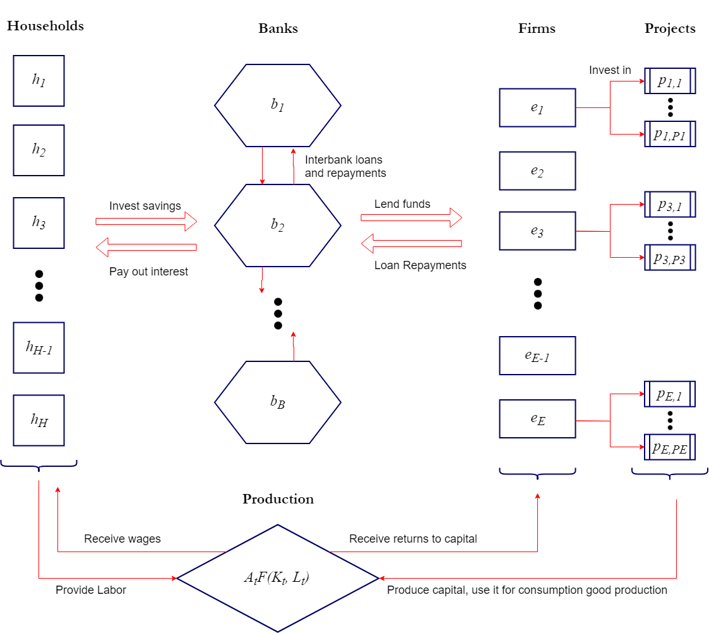

# The Economy

## Overview

In this model, the economy consists of three types of agents (the set of agents is denoted by $\mathcal{A}$), each of discrete measure:

\[
\mathcal{A} = <\{\mathcal{H}_h\}_{h \in H},\{\mathcal{B}_b\}_{b \in B},\{\mathcal{E}\}_{e\in E}>
\]

Where the three types are:

* households ($\mathcal{H}$), numbering $H$, with a typical member $h$; 
* banks ($\mathcal{B}$), numbering $B$ with a typical membrt $b$; 
* and firms (or entepreneurs - $\mathcal{E}$), numbering $E$, with a typical member $e$.  

There are also two goods - a consumption good $c$ (which also serves also as a store of value and a numeraire), and a production good (capital - $k$). Households are endowed with labor units $l$, while firms have access to a production technology ("projects" - described below), that allows them to convert units of the consumption good into units of the production good. The total amount of labor $L$, and the total amount of capital $K$, can be combined to produce units of the consumption good, by the production function $AF(K,L)$. After production owners of capital and labor receive the respective rental rate ($r$) and wage rate ($w$) in terms of units of $c$.

Households choose how much to consume each period, for which they receive utility $u(c)$, and how much to save. It is assumed that households and firms cannot interact directly. Instead savers can choose to deposit savings in a intermediary (bank). In return the bank pays a per-period interest on savings. Firms interact with banks by taking out loan contracts (in terms of $c$) and repaying interest. It is assumed that banks are free to engage into loan contracts among each other, while other agents can only engage with banks (the implementation mechanism is explained into detail below).

Firms can use their funds (either earned thorugh return to capital or loaned from banks) to invest into projects. A project is a technology that requires a fixed up-front investment of consumption good and which returns a stohastic flow of units of the investment good. It is assumed that each unit of the investment good produced is immedeately devoted to production of the final good.

The following diagram summarizes the process:





## Interactions

Each period of the economy consists of a series of interactions between agents (or between agents and environment). The turn in which this interactions happen is as follows:

> 0. Interest payments on outstanding loans from firms to banks and from banks to households (in that order) are repaid. Any potential insolvencies are resolved.
1. Each bank decides
  + Whether and by how much to change the interest rate offered on deposits
  + Whether and by how much to change the interest rate offered on loans
2. Banks decide whether to 
3. Each household examines all of its outstanding deposits and decides whether to wtihdraw it or not.
4. Each household gets matched with three random banks and decides whether to invest its available funds in any of it at the current deposit rate. Everything not invested is consumed.
5. Each firm is randomly matched with a project. The firm then decides whether to keep the project or discard it. Each firm that decides to keep the project and has enough funds to invest in it does so.
6. Firms that decide to keep the project but don't have enough funds to invest are randomly matched with three banks. They then chose to which of the three to apply for a loan (at the current loan interest rate).
7. Banks that have received a loan application make a yes/no decision on each application. If approved the firm receives a fixed-payment loan on the current loan interest rate, with a maturity defined by the project duration.
8. Banks with excess reserves decide whether and how much divident to distribute (in discrete porportion of the total amount of excess reserves)
9. Each project yields units of the production good for the firm that owns it
10. All units of labor and of te production good are invested in final good production. Firms and households receive factor income.

The following gives out more details about each step of the period:

### Step 0
At the very beginning of the period all interest payments from firm to banks and from banks to households are made. This step is automatic and does not require active decision making. On the firms side, since every project undertaken from the firm is financed by at most one bank, the repayment procedure can be expressed in pseudo-code as:

```
for (firm in Firms):
  for (project in firm.projects):
    bank = project.bank
    payment = project.interest
    if (firm.assets > payment):
      firm.assets.decrease(payment)
      bank.assets.increase(payment)
    else:
      bank.assets.increase(firm.assets)
      firm.default()
    end if
  end for
end for
```
Older loans are repaid first. If the firm cannot repay a loan a default procedure ensues. When a firm defaults, all its projects are liquidated (each project has a liquidation value). Banks that have given out lonas for each project then receive the liquidation amount (which could aslo be $0$). A defaulted stays inactive for four periods, after which it is recapitalized (by the households) and resumes normal activity.

The process for payments from banks to depositors is similar. In the case of a bank default, depositors get paid on a first come - first serve basis. If a bank defaults it stays inactive indefinitely.

### Step 1
In the next step banks get to adjust the prices of their products. Each bank has two products - a deposit offering, and a loan offering. It is assumed that banks are restricted in their price adjustments, and can only change the price incrimentally in one period. More specifically, each bank can either increase or decrease the offered interest rate for a product by $0.1$ or $0.05$ percentage points in one period. The bank also has the option to leave the price of a loan/deposit unchanged.

We can express the options as follows:
```
for (bank in Banks):
  bank sets deposit interest rate at one of:
    current rate - 0.05%
    current rate - 0.10%
    current rate
    current rate + 0.05%
    current rate + 0.10%
  bank sets loan rate at one of:
    current rate - 0.05%
    current rate - 0.10%
    current rate
    current rate + 0.05%
    current rate + 0.10%
end for
```

There are two reasons for choosing this price modification scheme. First it ties into the framework of sticky prices that is often present in New Keynesian models. Second, at more importantly perhaps, it allows for an easire implementation of the agent's decision process described below. Some may argue that this mode of price adjustment can be considered unrealistic, but it is a limitation of the current modeling framework.

### Step 2

### Step 3
The next step is straightforward - each households makes a series of consecutive decisions (as many as the number of banks it has deposited funds into) whether to withdraw a deposit or not. Funds from withdrawn deposits are added to the households cash on hand.

```
for (household in Households):
  for (bank in household.depositBanks):
    decision = household.withdrawDecision(bank)
    if (decision == True):
      amount = household.depositBanks.amount
      bank.deposits.decrease(amount)
      household.cash.increase(amount)
    end if
  end for
end for
```

### Step 4
In the next step household decide where to deposit their cash on hand (or whether to consume it). The process goes as follows:

```
for (household in Households):
  matchedBanks = selectRandom(Banks, 3) # 3 random banks
  decision = household.DepositDecision(matchedBanks)
  if (decision == 0):
    household.consume(household.funds)
  else if (decision == 1):
    matchedBanks(1).deposits.increase(household.funds)
  else if (decision == 2):
    matchedBanks(2).deposits.increase(household.funds)
  else if (decision == 3):
    matchedBanks(3).deposits.increase(household.funds)
  end if
  household.funds = 0
end for
```

Here it is assumed that households cannot decide to consume a part of their cash on hand and invest the other. This is another limitation of the implementation, since allowing for that decision would have complicated the household part of the model significantly. Since the focus is mostly on interactions with the banks (and not consumption decisions per se) it was decided to limit the households' options in that way.

It is worth noting however, that even with this setup households can still smooth out intertemporal consumption in fine amounts by adjusting their deposit holdings at each turn.

### Step 5 
In this step firms receive a random draw of three potential projects to invest in. Each project is characterized by: 

* a required up-front investment 
* a per-period mean return (in terms of the production good $k$), 
* per-period standard deviation of the return, 
* last-period mean return (again in terms of $k$), 
* standard deviation of the last-period return, 
* a liquidation value (in terms of $c$), 
* a 'sudden-stop' probability (hazard rate),
* and a duration period. 

Note the destinction between per-period return and last-period return. Some projects will yield a steady stream of capital, while others will yield a bulk amount at the end of their duration period. The firm can then choose which project to invest in (it can also choose neither). If the firm has available funds the project begins immedeatitely. Otherwise a loan is required.

If the firm decides not to invest in any project, then it is assumed that all it's available funds are distributed as dividents, and immedeately consumed by the entrepreneur.

```
for (firm in Firms):
  drawnProjects = selectRandom(Projects, 3)
  decision = firm.InvestmentDecision(drawnProjects)
  if (decision == 0):
    firm.divident(firm.funds)
  else if (decision == 1):
    if firm.funds > drawnProjects(1).upfront:
      firm.invest(drawnProjects(1))
    else:
      firm.loanApplication(drawnProjects(1))
    end if
  else if (decision == 2):
    if firm.funds > drawnProjects(2).upfront:
      firm.invest(drawnProjects(2))
    else:
      firm.loanApplication(drawnProjects(2))
    end if
  else if (decision == 3):
    if firm.funds > drawnProjects(3).upfront:
      firm.invest(drawnProjects(3))
    else:
      firm.loanApplication(drawnProjects(3))
    end if
  end if
end for
```

### Step 6
This step is quite similar to the step where households decide where to deposit their funds. Each firm gets reandomly matched with 3 banks and chooses to which one to apply for a loan. If the firm chooses neither, the project is discarded, and the firm's available funds (if any) are distributed as divident.

```
for (firm in Firms):
  matchedBanks = selectRandom(Banks, 3) # 3 random banks
  decision = firm.LoanDecision(matchedBanks)
  if (decision == 0):
    firm.divident(firm.funds)
  else if (decision == 1):
    matchedBanks(1).Applications.add(firm.loanApplication)
  else if (decision == 2):
    matchedBanks(2).Applications.add(firm.loanApplication)
  else if (decision == 3):
    matchedBanks(3).Applications.add(firm.loanApplication)
  end if
end for
```

The only complication is, that if the firm chooses one of the matched banks, the contract does not take effect immeadeately, but is subject to approval from the bank as well. This happens in the next step.

### Step 7
In this step each bank makes a series of consecutive yes/no decisions whether to accept or reject a loan application. If a loan application is accepted, and if regulatory conditions for lending are met, then the firm receives a fixed-per-period payment loan at the current lending rate of the bank. The maturity of the loan is equal to the firm's project duration. The loan amount is equal to the project up-front cost (minus any funds that the firm already has).

```
for (bank in Banks):
  for (application in bank.Applications):
    decision = bank.loanDecision(application)
    if (decision == True and meetsRegulations(application) == True):
      amount = application.amount
      bank.loans.increase(amount)
      application.firm.invest(application.project)
    end if
  end for
end for
```
So far I have been vague about what 'regulatory requirements' means. To clarify, each bank in the model must meet three requirements:

* A capital adequacy requirement
* A minimal reserve requiremnt
* A loss provision requirement

A loan is extended if and only if, after lending the bank will still meet all the requirements. Otherwise the loan is automatically rejected.


### Step 8
After all lending is done, banks that have excess reserves (i.e. reserves beyond the regulatory minimum) get to decide how much (if at all) dividends to distribute. As every other decision in the model, the action space of the banks is again discrete. It is assumed that they can choose the percentage of excess reserves to be distributed in increments of $20$ percentage point:

```
for (bank in Banks):
  if (bank.reserves < bank.minReserves):
    skip
  else:
    bank chooses one of:
      - distribute 0% of excess reserves as divident
      - distribute 20% of excess reserves as divident
      - distribute 40% of excess reserves as divident
      - distribute 60% of excess reserves as divident
      - distribute 80% of excess reserves as divident
      - distribute 100% of excess reserves as divident
  end if
end for
```

As with firms, when a bank distributes dividents, it is assumed that bank owners immeadeately consume them and receive the respective utility.

### Step 9
The final two steps of each turn are again automatic and don't require agent input. In this step each project yields units of the capital good for the firm. If the project is not in its final period, then the number of units is equal to a draw from a log-normal distribution with mean and standard deviation described by the projects per-period characteristics. A project in its final period yields again a draw from a log-normal distribution, but the mean and standard deviation are determined by the corresponding final-period characteristics of the project. 

More formally, if we denote $k^e_p$ the capital that project $p$ yields to firm $e$, and we let superscript $f$ denote final period quantitities:

\[
k^e_p=logN(\mu,\sigma)
\]

\[
k^{e,f}_p=logN(\mu^f,\sigma^f)
\]


Each project also has a 'sudden-stop' probability. At this stage based on a random draw the project might be destroyed pre-maturely. The firm will no longer have this project in its assets and will not get further yields from it.

### Step 10
In the final step firms invest all capital they have received at this turn from active projects into production of the final good. Households in turn devote their entire labor supply. It is assumed that final good production is competitive, and factors are paid their marginal products. 

\[
r_t = \frac{\partial{A_tF(K_t,L_t)}}{\partial{K}}
\]

\[
w_t = \frac{\partial{A_tF(K_t,L_t)}}{\partial{L}}
\]


The reason for this is that this part of the circular flow of the economy is not the focus of the paper, and doesn't need to be modeled explicitely. In fact we could have forgone aggregate production entirely, by saying that projects directly produce the consumption good, and that households only receive income through their savings. However the introduction of aggregate production allows for simulating aggregate shocks (via $A_t$) and examining their effect on the credit market.


# Agents


## Households

## Firms

## Banks

# Decision Making
